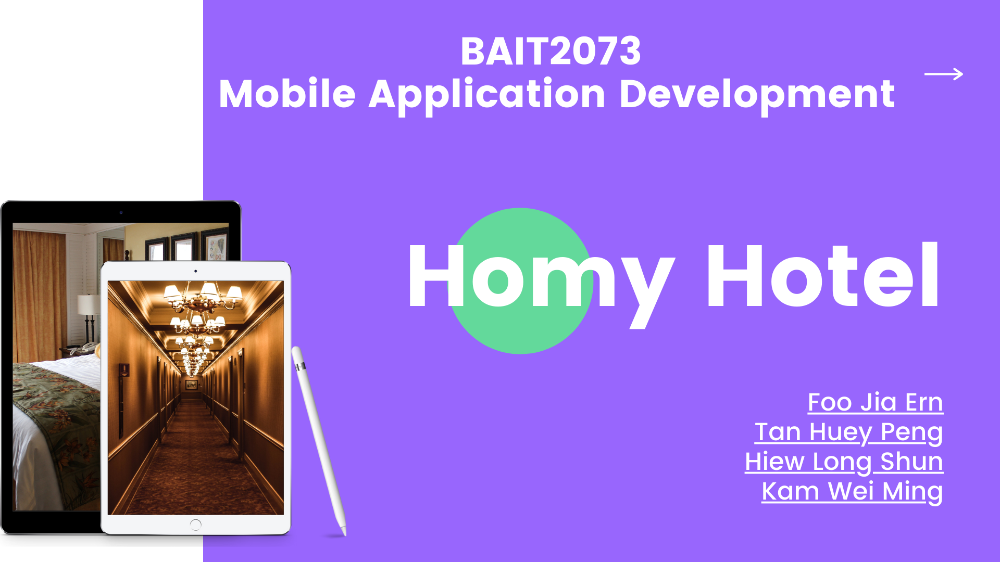
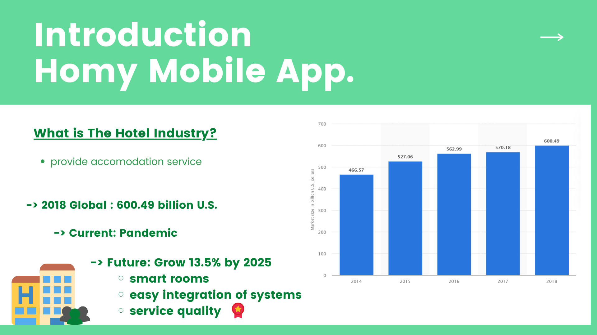
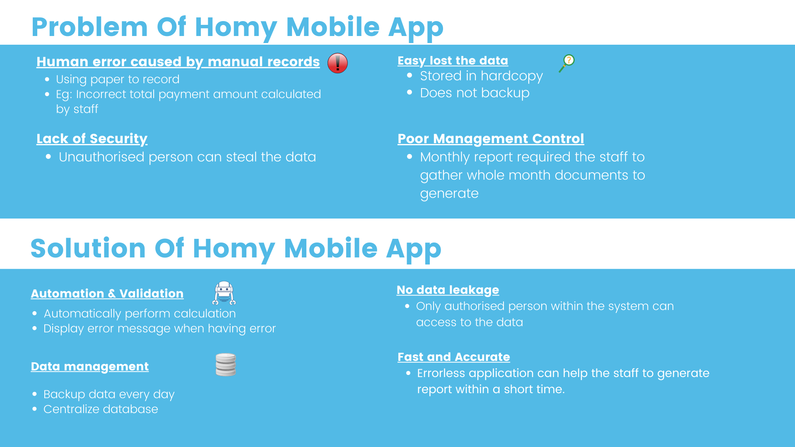
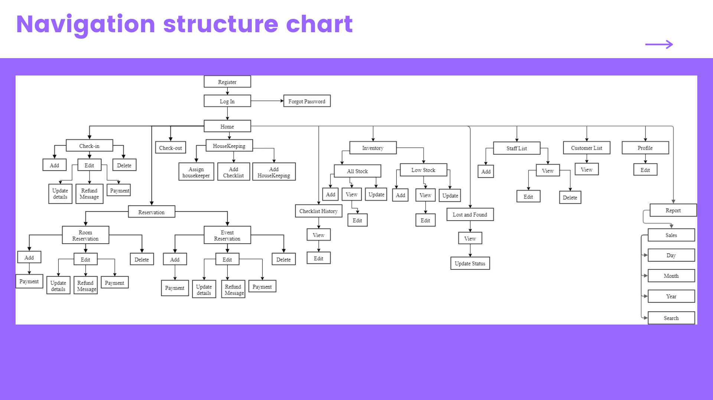
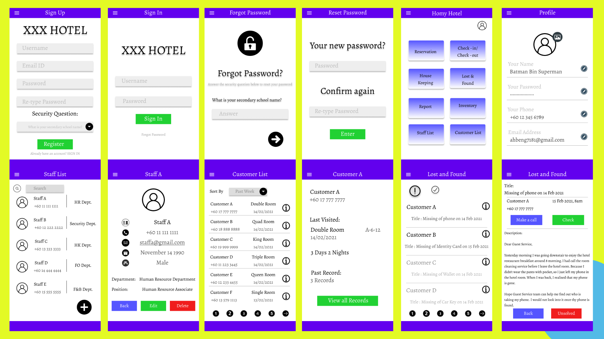
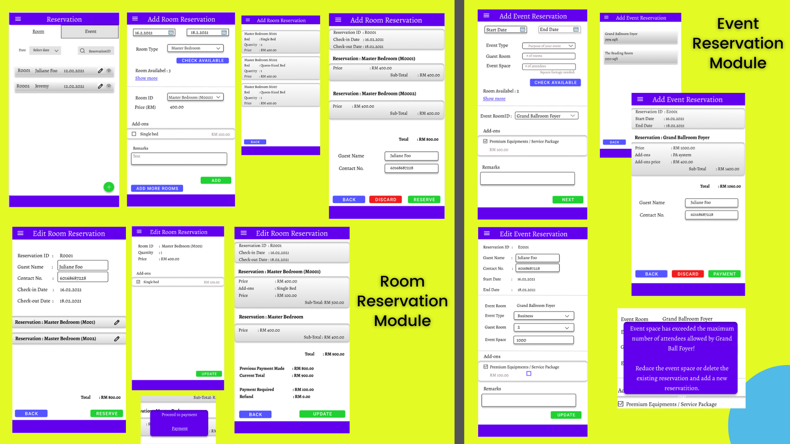
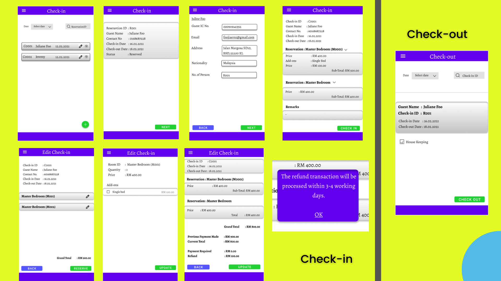
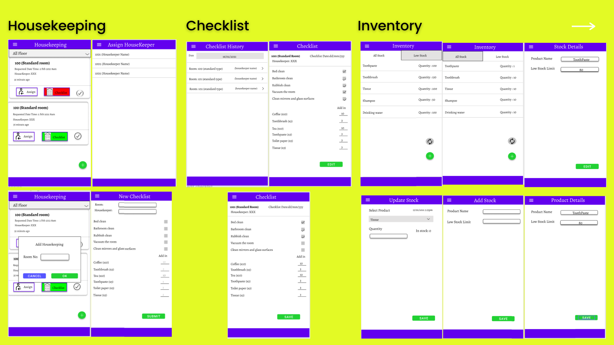
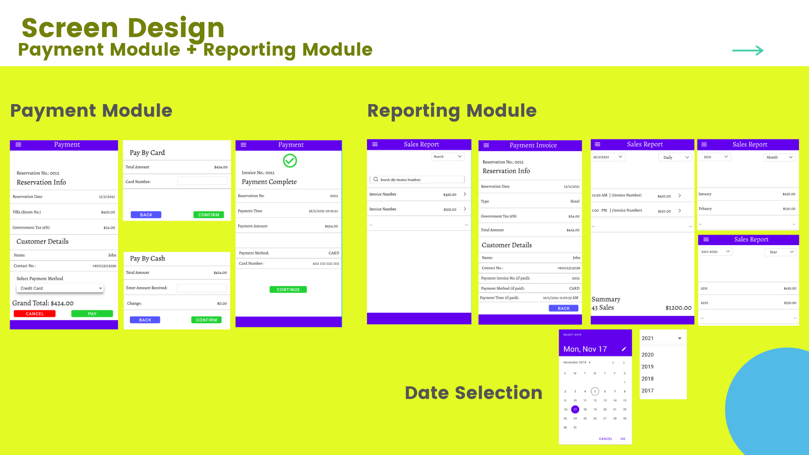
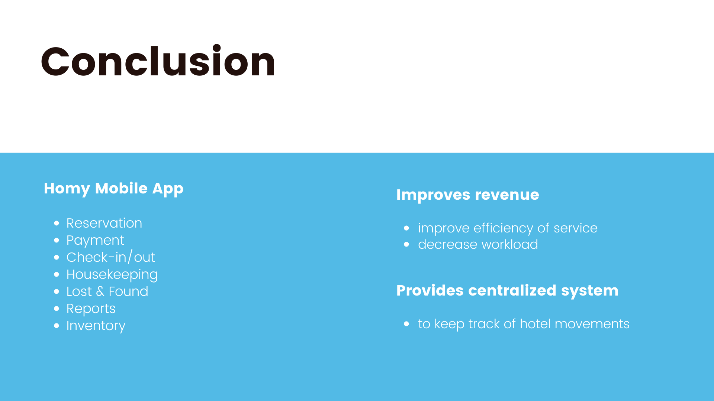

# Homi Hotel Management System

A hotel management system built using Kotlin and Java as primary development language, linked to Firebase database to handle data storage.

## Introduction

## Problems and Solutions

## Navigation & Structure chart

Refer to the `docs` folder for an editable `drawio` file.

## UI and UX

### Main Pages

### Room & Event Reservation Module

### Check-in and check-out module

### Housekeeping, checklist, and inventory

### Payment, reporting module

### Conclusion

